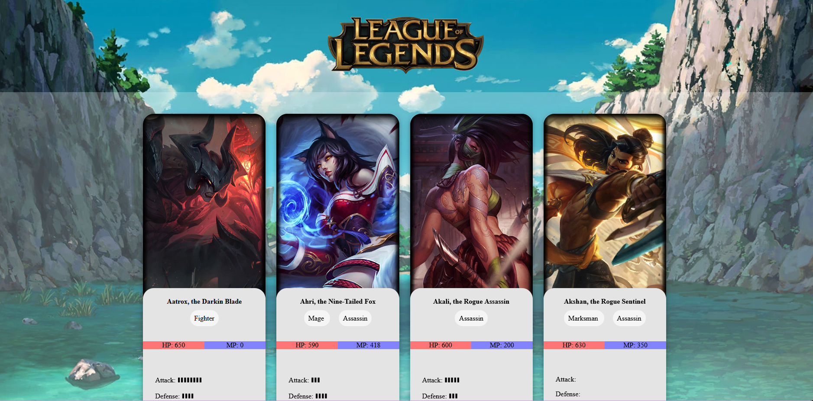

# :dragon: The Legendex

A League of Legends champeons gallery. The data is extracted using requests to the official API and displayed in the web using JavaScript to modify the DOM directly, injecting HTML.
For enhance the development process, a simple Model-View-Controller pattern was applied as introduction to design patterns.

This project was developed as homework for the Web Design subject of my Web Application Development formation.

## :wrench: Technologies

- `HTML`
- `CSS`
- `JavaScript`
- `npm`
- `parcel-bundler`

## :book: What I learned

### Introduction to design patterns

I learned a very introduction to the Model-View-Controller software architectural pattern commonly used for developing user interfaces that divides the program logic into three elements: the model as the internal representation of information, the view as the interface that presents information to the user and accepts input from user, and the controller as the software linking the another two.

### Fetch data from API and handle promises with `async/await`

I learned how to fetch data from external APIs using `fetch()` JavaScript function and handle the response in an asyncronous function using the `await` keyword to wait for the data.

### Modify the DOM programatically

With JavaScript I introduced HTML elements into the DOM to create gallery items dinamically with the API data received in the asyncronous function.

## :eyes: Demostration

[_The Legendex website_](https://jesuslugo2002.github.io/DOR-LeagueOfLegends/)

